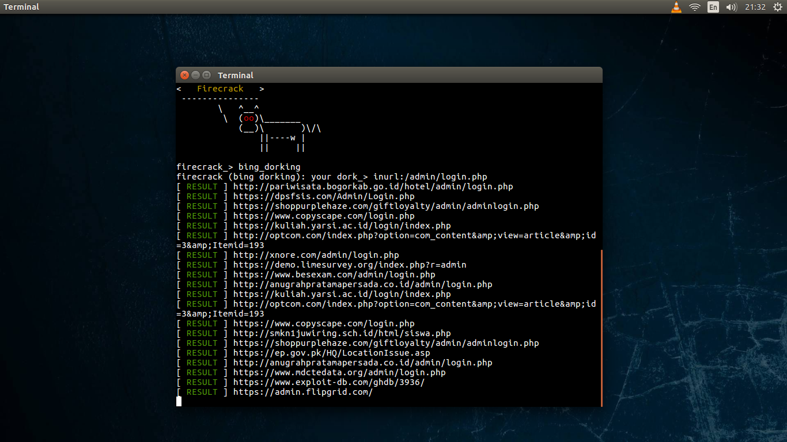

# FACEBOOKCRACK :fire:

What is facebookcrack tools ?
Facebookcrack tools are tools for testing and testing on websites or Facebook accounts, conducting<br>
testing on hundreds of Facebook accounts with random accounts and random wordlist, and there are<br>
for testing websites, such as admin finder and deface with file upload method, and Bing dorking<br>
to collect Many domains, Bing Dorking is useful if you are collecting a lot of domains.<br>
more tools: :point_down:<br>
<br>facebookcrack fiture:<br>

```
1.hack facebook (random attack)
2.bruteforce facebook (one account)
3.admin finder
4.bing dorking
5.deface (file upload)
```


## :camera: Screenshot:


## :mag_right: admin finder:


## :page_with_curl: bing dorking:


## :game_die: facebook hacking random attack:


## :globe_with_meridians: deface:


## install and usage:

**Termux:**
* `pkg install python2`
* `pkg install git`
* `git clone https://github.com/ALBINPRAVEEN/FACEBOOKCRACK`
* `cd Firecrack`
* `pip2 install -r requirements.txt`
* `python2 FACEBOOKCRACK.py`
* `help`

**Linux:**
* `apt-get install python`
* `apt-get install python-pip`
* `apt-get install git`
* `git clone https://github.com/ALBINPRAVEEN/FACEBOOKCRACK`
* `cd Firecrack`
* `pip install -r requirements.txt`
* `python FACEBOOKCRACK.py`
* `help`

```
NOTE:

1.before use facebook random attack, edit file "nano module/wordlist.txt" and add your wordlist if you want t you own.
2.before use facbookcrack deface, put your deface script one folder with FACEBOOKCRACK.py
```

